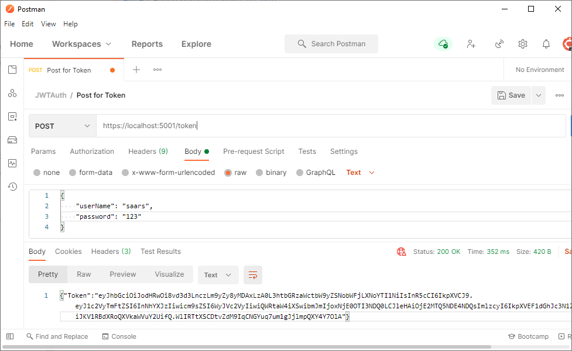
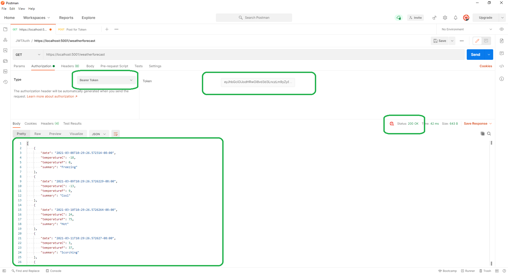

# JWTAuth.AspNetCore.WebAPI

Authentication implementation without identity server should still be simple in ASP.NET Core WebAPI. With this library, it is simple way to implement a JWT authentication.

## Get Started

1. Create a WebAPI using cli

    ```dotnetcli
    dotnet new webapi
    ```

1. Create a UserService to verify user info like it in [UserService.cs](example/UserService.cs).

1. Setup JWT authentication / authorization in [Startup.cs](./example/Startup.cs):

    ```csharp
    public void ConfigureServices(IServiceCollection services)
    {
        ...
        // The user service that will be used for validating users and roles.
        services.AddScoped<UserService>();
        // Add service to support JWT authentication
        services.AddJWTAuth(opt => {
            // This delegate will be called when user validation is needed.
            opt.OnValidateUserInfo = async (jsonBody, p) =>
            {
                UserService userService = p.GetRequiredService<UserService>();
                return await userService.CreateValidUserAsync(jsonBody).ConfigureAwait(false);
            };

            // This delegate will be called when role validation is needed.
            opt.OnValidateRoleInfo = async (userInfo, p) =>
            {
                UserService userService = p.GetRequiredService<UserService>();
                return await userService.ValidateRolesAsync(userInfo.Name).ConfigureAwait(false);
            };
        });
    }
    ...
    public void Configure(IApplicationBuilder app, IWebHostEnvironment env)
    {
        ...
        // Add this step in front of UserAuthorization().
        app.UseJWTAuth();
        ...
    }
    ```

1. Add `Authorize` attribute to route that needs protection like [WeatherForecastController.cs](./example/Controllers/WeatherForecastController.cs):

```csharp
using Microsoft.AspNetCore.Authorization;
...
[Authorize(Roles = "User")]    // Requires access token with a role of 'User' on it.
public class WeatherForecastController : ControllerBase
...
```

## Run the example

* To get an access token:

  When run it in Postman by issue a `POST` to the `token/` route:

  Use **HTTP Method: POST** with a body:

  ```json
  {
    "username": "user",
    "password": "123"
  }
  ```

  

* To access the protected resource, for example:

  * Copy the token above.

  * Use **HTTP Method: GET** on route: `/weatherforecast`, put the token copied to the `Bearer` authentication header:

  

## Customization

* Use a different endpoint for token:

    By default, the token is exposed on `/token`. It can be customized in [appsettings.json](./example/appsettings.json):

    ```jsonc
    {
      ...
      "JWTAuth": {
        "TokenPath": "/api/token"
      }
    }
    ```

    You can also customize those when adding JWTAuth in service:

    ```csharp
    services.AddJWTAuth(opt => opt.TokenPath="/api/token");
    ```

    Actually, there are various options that could be configured in the same way. Refer to [JWTAuthOptions.cs](./src/JWTAuthOptions.cs) for all of them.

    _Tips: Always setup `IssuerSigningSecret` in Production system to have a stable signing key. It is critical when you scale out your service._

* Use a different user credential (other than username/password)

  `DefaultUserLogin` is provided in the convenience for login requests that uses a username and a password. It could be customized:

  * Create a model class:

  ```csharp
  public class MyUserLogin
  {
      public string SharedKey {get; set;}
  }
  ```

  * Update the `UserService` class above to take `MyUserLogin`:

  ```csharp
  internal class UserService : UserServiceBase<MyUserLogin>
  ```

  * Making sure the client is POST with a proper body for authentication:

  ```json
  {
    "sharedKey": "what-ever-your-secret-is-that-will-pass-user-validation...",
  }
  ```
