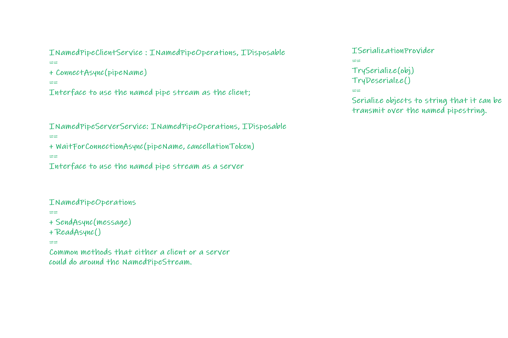

# Two-way named pipe stream wrapper

## Description

This is a simple warper around named-pipe for **local**, **two-way**, **inter-proc** communication.

* **src/DuplexNamedPipeService** contains the implementations.
* **src/Example.Server** spins up a named pipe server;
  * [Program.cs](./examples/Example.Server/Program.cs)
* **src/Example.Client** spins up a named pipe client;
  * [Program.cs](./examples/Example.Client/Program.cs)
There are string transmitting from either side; there are serialized object transfer too.

## Getting Started

Refer to [Program.cs](examples/GetStartedConsole/Program.cs) for the complete code:

* Start services with factories:

  * Start a server:

    ```csharp
    // Create the server service
    INamedPipeServerService namedPipeServer = NamedPipeServerFactory.Instance.CreateNamedPipeService();

    // Wait for connection
    await namedPipeServer.WaitForConnectionAsync(pipeName, cancellationToken: default).ConfigureAwait(false);
    ```

  * Start a client:

    ```csharp
    // Create a client service
    INamedPipeClientService namedPipeClient = NamedPipeClientFactory.Instance.CreateNamedPipeService();
    // Try to connect to the server using the pipeName
    await namedPipeClient.ConnectAsync(pipeName, cancellationToken: default).ConfigureAwait(false);
    ```

* Sending messages back & forth

  * Sending a message:

    ```csharp
    await namedPipeServer.SendMessageAsync("Hello from server!").ConfigureAwait(false);
    ```

  * Receiving a message:

    ```csharp
    string messageReceived =await namedPipeClient.ReadMessageAsync().ConfigureAwait(false);
    ```

Notes: The applicaiton above uses 2 threads to simulate 2 processes for simplicity. See the next example for code running in separate processes:

## To run the examples in multiple processes

Start the server in a console:

```shell
dotnet run src/Example.Server
```

The server will start and wait for clients to connect.

Then, in another console, run:

```shell
dotnet run src/Example.Client
```

The client will connect to the server and unlock the flow.

## Dependency Injection supported for ASP.NET Core applications

Check out [UseWithDI example](examples\UseWithDI\Program.cs) for full code. Here's the key lines.

* Register the service

  Do one of the following in your applicaiton. Do it in the Startup for ASP.NET Core application:

  * Register the server

    ```csharp
    // Add NamedPipe server to the service collection, configure timeout by code
    serviceCollection.AddNamedPipeServer(opt => opt.ConnectionTimeout = TimeSpan.FromMinutes(2));
    ```

  * Or register the client:

    ```csharp
    // Adding NamedPipe client, using the default configure from IConfiguration
    serviceCollection.AddNamedPipeClient();
    ```

  Inject and use the following serivces respectively:

  * INamedPipeServerService, or
  * INamedPipeClientService

  For example:

    ```csharp
    await _serverService.WaitForConnectionAsync(pipeName, cancellationToken: default).ConfigureAwait(false);
    ```

## Goal

* Make two-way inter-process communication (IPC) simple;
  * Allows mimimum configuration and establish a pipe for communication.

* Have a clear, designed architecture to avoid Server-Client confusion;
  * One process will either be a server or a client, won't be both.

## Folder Structure

* [src/DuplexNamedPipeService](./src/DuplexNamedPipeService)
  * Primary service implemenation.

* [examples/Example.Client](./examples/Example.Client)
  * Example for how to use it as a client.

* [examples/Example.Server](./examples/Example.Server)
  * Example for how to use it as a server.

* [examples/DataContracts](./examples/DataContracts)
  * Data object that used in the example for trasmitting.

## Architecture

There are 3 primary interfaces plus 1 helper / extension interface:



They serve different purposes:

* INamedPipeClientService

  * For the client code to use the NamedPipeStream as a client;
  * So that the client code won't call into a server method by accident;

* INamedPipeServerService

  * For the client code to use the NamedPipeStrema as a server;
  * So that the client code won't call into a client method by accident;

* INamedPipeOperations

  * Common operations for both Server and Client;
  * In a two way communication environment, the message trasmit methods should be allowed on both the client side and the server side of the named pipe.

* ISerializationProvider

  * Used to serialize / deserialize object so that they could be transmit over the pipeline.

There are some other helper classes like `NamedPipeOptions` that allows customizaiton of the pipeline.

## Limitation

For the simplicity, EOL is used as separator for messages; Messages with EOL in it requires escaping to work.
